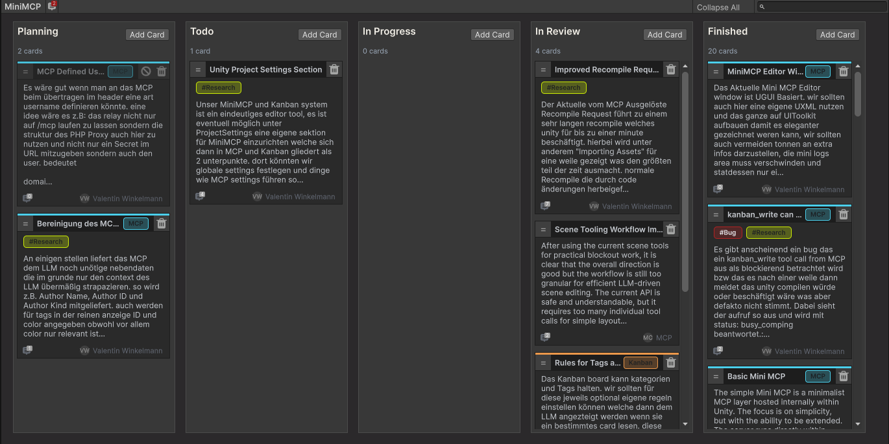

# 📅 Mini MCP for Unity

Mini MCP is a compact Model Context Protocol server for Unity with an integrated Kanban board for task management inside the editor.

It is built for teams and solo developers who want a practical bridge between LLM-based tooling and real Unity project work: inspect scenes, read editor state, trigger controlled actions, run tests, and keep task context close to the project instead of spreading it across external tools.

## ⁉️ What It Is

Mini MCP combines two parts into one package:

1. A Unity-focused MCP server layer that exposes curated editor and project operations.
2. A Kanban board system embedded into Unity for planning, review, and AI-assisted workflow context.

The goal is not to be a huge framework. The goal is to be a focused, production-practical toolset for controlled editor automation and lightweight project coordination.

## 💡 Core Ideas

1. Keep the MCP surface small and understandable.
2. Prefer safe, editor-aware operations over broad unrestricted automation.
3. Keep task context close to the Unity project.
4. Make LLM collaboration more useful by exposing structure, not noise.
5. Start with a deliberately small built-in toolset, but make custom extension straightforward.

## 📌 Requirements

Mini MCP requires Node.js because the relay is a required part of the system.

The Unity-side package contains the editor integration, but Mini MCP depends on the relay process to behave correctly across Unity recompiles and transient editor restarts. Without the relay, a Unity recompile would surface to clients like a generic fetch failure instead of a distinguishable compile transition with a clean awaited result.

If Node.js is not installed, the relay cannot be started and Mini MCP cannot operate reliably.

## 📥 Installation

Mini MCP can be installed directly through the Unity Package Manager.

1. Open the Unity Package Manager.
2. Choose `Install package from Git URL...`
3. Enter `https://github.com/valentinwinkelmann/Mini-MCP`

This installs the package directly from the Git repository.

## 🛠️ Included Capabilities

Mini MCP currently includes functionality such as:

1. Tool discovery through MCP.
2. Unity editor state inspection.
3. Scene hierarchy inspection and selected scene mutations.
4. Console log access.
5. Play mode control.
6. Script recompile triggering with awaited completion over MCP.
7. Unity Test Runner integration.
8. Kanban board reading and writing tools.
9. Rule-aware category and tag metadata for Kanban workflows.

## 🧩 Extensibility

Mini MCP intentionally ships with a relatively small default tool surface.

That is a design choice, not a limitation.

The package is built so you can add your own Unity-specific tools without having to fight a large framework first. The included tools provide a solid baseline, while the MCP infrastructure, schema attributes, tool registry, and editor integration make it practical to extend the system for project-specific workflows.

This makes Mini MCP suitable both as a ready-to-use package and as a foundation for custom in-house toolchains.

## 🔁 Awaited Recompile

Mini MCP can trigger a Unity script recompile through MCP and await the result instead of only firing the action blindly.

That means an MCP client can request a recompile, wait for Unity to finish the compilation cycle, and then continue with a concrete completion result instead of guessing when the editor is ready again. This is especially useful for iterative tool development, validation flows, and agent-driven editor workflows.

## 📋 Kanban Board

The integrated Kanban system is not a separate afterthought. It is part of the workflow model.

It allows you to:

1. Store planning state directly in the project.
2. Organize cards by status, category, and tags.
3. Add comments and collaboration context.
4. Surface workflow information to MCP tools in a structured form.
5. Keep implementation tasks and AI context aligned.

This makes Mini MCP useful not only as an editor bridge, but also as a lightweight execution system for real production work.

## 🌐 Optional Proxy Helper

The package also includes an optional helper file:

1. [MiniMcpProxy.example.php](Media~/MiniMcpProxy.example.php)

This file can be used as a starting point for custom relay or proxy setups. It is not required for local package usage, but it may be useful when integrating Mini MCP into a hosted or bridged environment.

## 📦 Package Structure

The package is organized into clear functional areas:

1. `Runtime/Kanban` for Kanban runtime data structures.
2. `Runtime/MCP` for MCP runtime foundations.
3. `Editor/Kanban` for Kanban editor UI and workflows.
4. `Editor/MCP` for MCP editor infrastructure.
5. `Editor/Tools` for the exposed tool implementations.

## 📜 Licensing

This repository and package are distributed under a classic proprietary license. Use, redistribution, modification, sublicensing, resale, and commercial handling are only permitted within the terms explicitly granted by the author or an accompanying commercial agreement.

There is no warranty and no guarantee of fitness for a particular purpose. Valentin Winkelmann, as the developer, does not guarantee and is not obligated to provide updates, fixes, support, compatibility maintenance, or future versions unless explicitly agreed in writing.

See [LICENSE.md](LICENSE.md) for the full license terms.

## ⚠️ Disclaimer

This package is provided as-is. It is designed to be practical and useful, but it comes without promises regarding support scope, future development cadence, or compatibility with every workflow and environment.